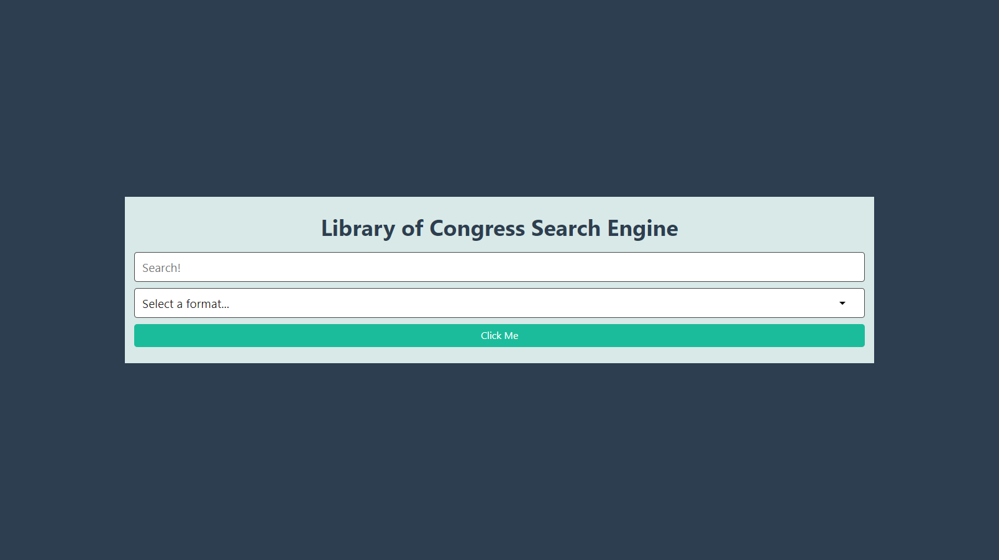
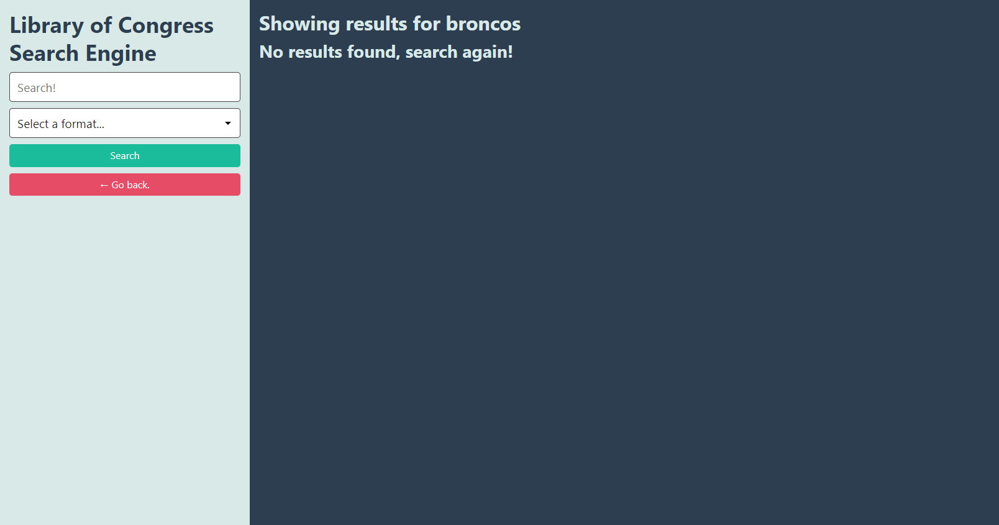

# Library-of-Congress-Search-Tool

In this project, I am building an application that searches and displays results from the Library of Congress API.

## Description

The completed application should meet the following criteria:

* As a user, I can submit a search query from the application to request data and receive a response from the Library of Congress.

* As a user, I can either perform a generic search for data in all formats or I can select a format in the form to help filter results.

* As a user, I can see all of the results of my search displayed on a separate page.

* As a user, I can conduct additional searches from the results page as well.

### Credits 

[Library of Congress API documentation on requests](https://libraryofcongress.github.io/data-exploration/requests.html#format).

  

 [Library of Congress API documentation on the format endpoint](https://libraryofcongress.github.io/data-exploration/requests.html#format).

[Library of Congress API documentation on the search endpoint](https://libraryofcongress.github.io/data-exploration/requests.html#search).

 [Library of Congress API documentation on responses](https://libraryofcongress.github.io/data-exploration/responses.html).

## Deployed Webpage 
https://eugeneisingizwe.github.io/Library-of-Congress-Search-Tool/
## MocK Up

---
© 2022 Trilogy Education Services, LLC, a 2U, Inc. brand. Confidential and Proprietary. All Rights Reserved.